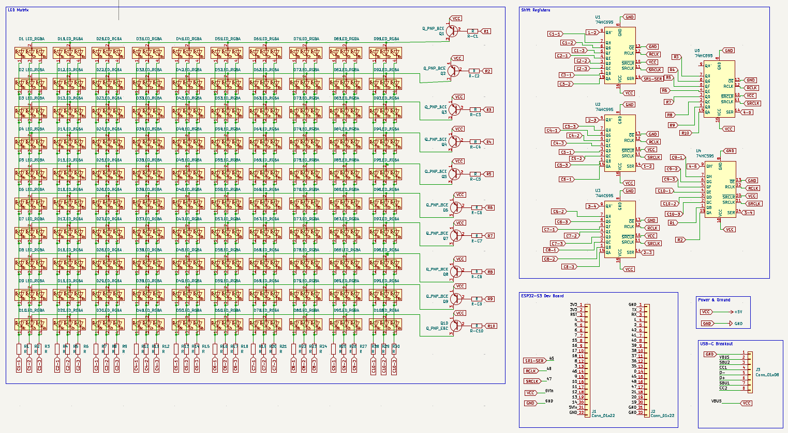
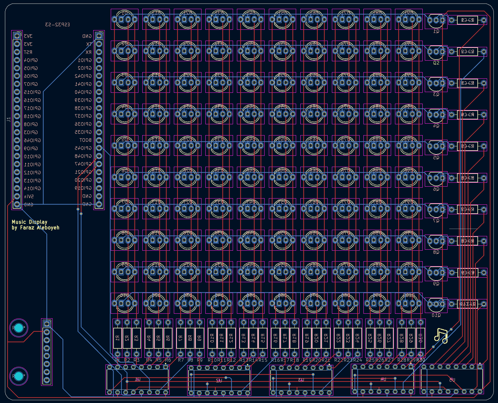

# Custom-Built Music Display

Repository includes the firwmare used to display the artwork of a currently streaming song from Spotify onto a custom-built 10x10 display, as well as all primary KiCad project files used to design the display itself. 

## Hardware 
### Comprehensive Component List
* 100 RGB LEDs, multiplexed
* 10 100Ω, 10 150Ω, 10 220Ω, & 10 1kΩ resistors
* 5 (74HC595) shift registers, daisy-chained.
* 10 PNP BJTs
* An ESP32-S3, development board
* A USB-C breakout board

### Core Display Functionality
The display is driven by an ESP32 microcontroller, which is responsible for streaming color data to the chained shift registors, among other tasks. Transistors are present along all rows which act as high-side power switches between the main power rail and the shared anodes, so that the (output-limited) shift registers are not solely responsible for driving entire rows themselves. 1kΩ current-limiting resistors are present along rows to protect the shift registers and LEDs from overheating & overcurrent, with per color resistors along each column to finely tune color output (100Ω for red columns, 150Ω, green, & 220Ω blue). Images of the schematic, PCB design, & soldered board are all shown below for visual reference.

## Firmware 
### Interrupt-Driven Binary Code Modulation (BCM)
Instead of standard PWM, this driver uses BCM driven by an ESP32 hardware timer. The matrix is scanned row-by-row, shifting 8 distinct bitplanes per row. Each bitplane's display time doubles (5µs, 10µs, 20µs, etc.), reconstructing 8-bit color depth visually while minimizing CPU load.

