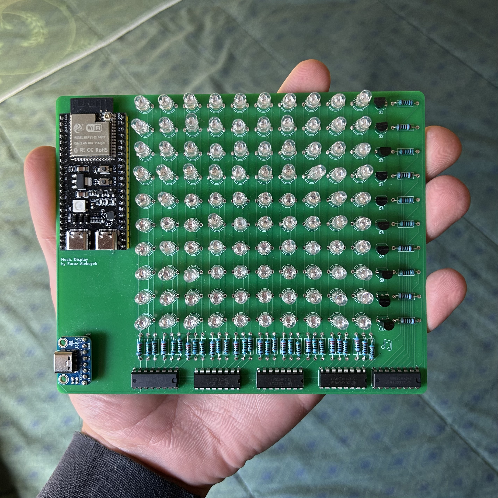

# Custom-Built Music Display

Repository includes the firmwmare used to display the artwork of a currently streaming song from Spotify onto a custom-built 10x10 display, as well as all primary KiCad project files used to design the display itself. 

The system works by first calling Spotify's APIs to fetch all data regarding the user's playing music. From the given information, a link to the  album art is then used to store all JPEG data (as a stream of bytes) to an internal buffer. The TJpg Decoder library is used to decode the buffer as RGB565 data, which perpetually reaches out to a separate callback function, which converts again to RGB888 and also write to the display's back framebuffer. When the front and back framebuffers are swapped, a continuously firing interrupt displays the artwork by streaming the bitplanes (sequentially by time slice and physical row), to the display's shift registers. 

## Hardware 
### Comprehensive Component List
* 100 RGB LEDs, multiplexed
* 10 100Ω, 10 150Ω, 10 220Ω, & 10 1kΩ resistors
* 5 (74HC595) shift registers, daisy-chained.
* 10 PNP BJTs
* An ESP32-S3, development board
* A USB-C breakout board

### Core Physical Functionality
The display is driven by an ESP32 microcontroller, which is responsible for streaming color data to the chained shift registers, among other tasks. Transistors are present along all rows which act as high-side power switches between the main power rail and the shared anodes, so that the (output-limited) shift registers are not solely responsible for driving entire rows themselves. 1kΩ current-limiting resistors are present along rows to protect the shift registers and LEDs from overheating & overcurrent, with per-color resistors along each column to finely tune color output (100Ω for red columns, 150Ω, green, & 220Ω blue). Images of the schematic, PCB design, & soldered board are all shown below for reference.

  
   
  <i>Schematic diagram, designed in KiCad.</i>

 

  
   
  <i>PCB layout, designed in KiCad.</i>

 

  
   
  <i>Soldered PCB, note that the breakout is still the missing screws and washers necessary for securing it to the board but is otherwise complete.</i>

## Firmware 
### Core Logical Functionality

### API Access
The basis of the project lies in interfacing with Spotify's APIs to receieve user data regarding their currently playing music. Every time the program begins running, and after a successful Wi-Fi connection is established, one of the first tasks to run is the retrieval of a new Access Token from Spotify's servers. As per the Spotify's requirements, Access Tokens are inherently ephemeral, expiring automatically every 3600 seconds (1 hour) regardless of scope. Thus, a function runs every 55 minutes to renew the Activation Token automatically, ensuring the display can be used for extended periods of time. 

There is not currently, however, any avenue for renewing the Refresh Tokens  automatically at the time of writing. Given they expire every 4 months, an implementation for such was not listed as high-enough priority but is in the works. 

### Interrupt-Driven Binary Code Modulation (BCM)
Instead of standard PWM, which would demand an unsustainable 2,550 SPI updates per frame (10 rows x 255 steps) and cause severe CPU starvation, the driver implements Binary Code Modulation via the microcontroller's hardware timer. By shifting only 8 exponentially weighted bitplanes per row (5µs, 10µs, 20µs, etc.), BCM slashes bus traffic by 97% to just 80 updates per frame, reconstructing full 8-bit color depth through visual persistence while leaving the CPU free for WiFi and JPEG decoding.

### Double Buffering
To prevent screen tearing during WiFi fetches or JPEG decoding: Operations draw to a back framebuffer (`draw_buffer`), `display.swap()` unpacks the back buffer into physical bitplanes (`bitplanes[10][8][5]`), & the ISR (`on_timer`) exclusively reads from the active bitplanes.
